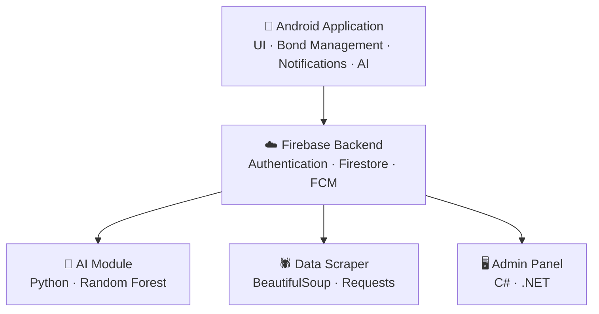

# 🎯 Prize Bond Tracker

An intelligent Android application that simplifies prize bond management through AI-powered winning probability predictions, real-time draw tracking, and personalized investment recommendations.

---

## 📱 Overview

Prize Bond Tracker is a Final Year Project developed for PMAS-Arid Agriculture University, Rawalpindi. The application enables Pakistani prize bond investors to digitally manage their bonds, access six years of historical draw data sourced from National Savings Pakistan, and receive AI-generated insights to support smarter investment decisions.

---

## ✨ Features

### 👤 User Module
- 🔐 Secure Registration & Authentication
- 📋 Prize Bond Registration & Management
- 📦 Bulk Bond Entry (Range-Based)
- 📅 Historical Draw Results (Last 6 Years)
- 🔔 Push Notifications for New Draw Results
- 🤖 AI-Based Winning Probability Prediction
- 💡 Budget-Based Bond Recommendations
- 👤 User Profile Management

### 🛡️ Admin Module
- 🔐 Secure Admin Authentication
- 👥 User Management
- 📊 Draw Result Management & Verification
- 📁 Historical Data Maintenance
- 🖥️ System Monitoring

---

## 🧠 Artificial Intelligence

### Random Forest Prediction Model
The system uses a **Random Forest machine learning model** trained on historical draw data to estimate each bond's winning probability.

**Input Parameters:**
- Historical draw records
- Bond denomination
- Draw frequency
- Previous winning trends

**Output:**
- Winning probability score per bond
- Probability ranking among registered bonds
- Historical trend insights

### Recommendation Engine
Combines AI probability scores with budget-aware filtering to deliver personalized bond suggestions.

**Workflow:**
1. Analyze historical draw data
2. Predict probability using Random Forest
3. Evaluate user budget
4. Filter and rank suitable bonds
5. Generate personalized recommendations

---

## 🗄️ Historical Data Management

Draw records covering the **last 6 years** are maintained through a hybrid approach:

| Method | Details |
|--------|---------|
| **Automated** | Python web scraper pulling from National Savings Pakistan |
| **Manual** | Admin dashboard for uploads, corrections, and validation |

This ensures data accuracy, consistency, and reliability.

---

## 🏗️ System Architecture


---

## 🛠️ Tech Stack

### 📱 Mobile App
| Layer | Technology |
|-------|-----------|
| Language | Java |
| UI | XML |
| IDE | Android Studio |

### ☁️ Backend
| Service | Technology |
|---------|-----------|
| Authentication | Firebase Auth |
| Database | Firebase Firestore |
| Notifications | Firebase Cloud Messaging |

### 🤖 AI & Data
| Purpose | Technology |
|---------|-----------|
| ML Model | Python, Scikit-Learn |
| Data Processing | Pandas, NumPy |
| Web Scraping | BeautifulSoup, Requests |

### 🖥️ Admin Panel
| Layer | Technology |
|-------|-----------|
| Language | C# |
| Framework | .NET |
| IDE | Visual Studio |

---

## 🚀 Getting Started

### Prerequisites
- Android Studio Hedgehog or above
- Android SDK 24+
- Java 8+
- Python 3.x
- Firebase Project Setup

### Installation

**1. Clone the repository**
```bash
git clone https://github.com/sawairatanveer10/PrizeBondTracker.git
```

**2. Open in Android Studio**
